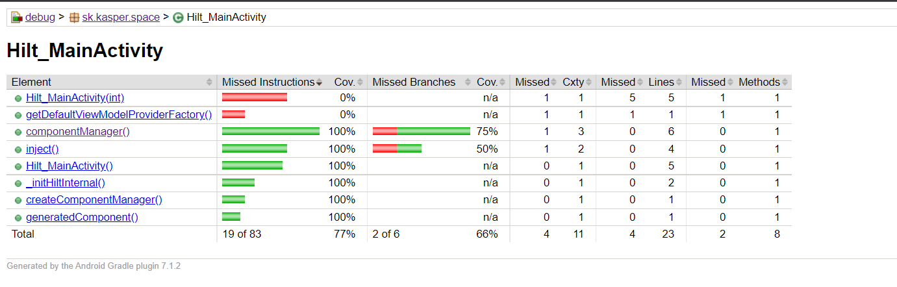
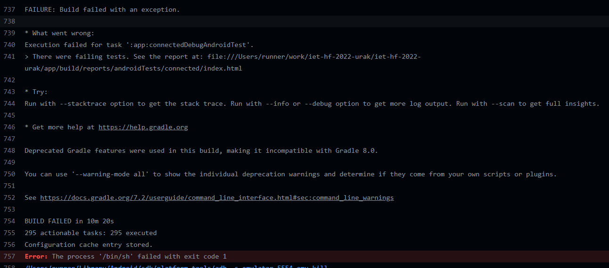

# Dokumentáció a kódlefedettség mérésével és Unit tesztekkel kapcsolatban

A unit tesztek a kód alapvető működését ellenőrzik. Gyorsak, minimális erőforrást igényelnek, mert az egyes tesztelendő osztályokat, függvényeket önmagukban ellenőrizzük, a szükséges függőségeket pedig "mock-oljuk".
A tesztelési piramis alapját (alját) testesítik meg. Szemben a UI / integrációs tesztekkel, a unit tesztek írásakor a cél a minél nagyobb kódlefedettség, minél több (értelmes) unit teszt írása.

A projekt amit fejlesztésre választottunk, már rendkívül sok unit tesztel volt eredetileg is bővítve. Ezek kiegészítése nehézkes volt, nem sok tesztelhető, de teszteletlen részt találtunk. Az általunk újonnan írt tesztek a DateUtils osztály lefedettségét emelik fel 100%-osra.

A kód lefedettség mérésére a jacoco eszközt választottuk, mely android-gradle projektekhez is jól használható.

Első sorban a gradle fileokat kellett kiegészítenünk, melyben egy internetes tutorial (https://about.codecov.io/blog/code-coverage-for-android-development-using-kotlin-jacoco-github-actions-and-codecov/) volt segítségünkre.
A megfelelő pluginok, verziók, taskok beállítása után lokálisan elkészíthettük a jelentéseket, melyket az Android Studio által biztosított 'Run -> Import Test from file' funkcióval is ellenőrizhettünk, illetve többféle xml és html fájl is létrejött a tesztesetekhez.

Például tesztek sikerességéről:

A kód lefedettségéről:

Az utolsó tervünk a GithubActions beüzemelése lett volna a projekt CI-jának, hogy minden push és pullrequest esetén lefusson egy teszt.
Az automatikus teszteléshez új github workflow-t hoztunk létre (workflows/newCodeCov.yml fájl írja le az egyes lépéseket), illetve ezt kötöttük össze a codecov.io report generáló rendszerével (ami az automatizált tesztek során létrejövő lokális eredményeket összesíti az online felületén).

    name: CodeCov

    on:
        push:
            branches: [ main ]
        pull_request:
            branches: [ main ]

    jobs:
        build:
            runs-on: macos-latest

            steps:
                - uses: actions/checkout@v2
                    with:
                    java-version: 11
                    
                - name: set up JDK 11
                    uses: actions/setup-java@v1
                    with:
                        java-version: 11

                - name: Unit Test with Android Emulator Runner
                    uses: ReactiveCircus/android-emulator-runner@v2.14.3
                    with: 
                        api-level: 29
                        script: ./gradlew connectedCheck 
                        java-version: 11

                - name: generate report
                    uses: actions/upload-artifact@v2
                    with:
                    name: report 
                    path: app/build/reports/coverage/debug

                - name: Download Test Reports Folder
                    uses: actions/download-artifact@v2
                    with:
                    name: report
                    path: app/build/reports/coverage/debug

                - name: Upload Test Report
                    uses: codecov/codecov-action@v2
                    with:
                    files: "app/build/reports/coverage/debug/report.xml"

A buildelés alatt azonban több errorba is beleütköztünk, melyek közül volt amit nem sikerült javítani a feladat leadásának határidejéig.
(Az utolsó megoldatlan error a virtuális gépen elindított build során: gradle verzió problémák).

Így az automatizálás elmaradt, de a kód lefedettségét bármikor ellenőrizhetjük a következő parancsok futtatásával:

* .gradlew connectedCheck
* .gradlew testDebugUnitTest
* .gradlew connectedDebugAndroidTest

