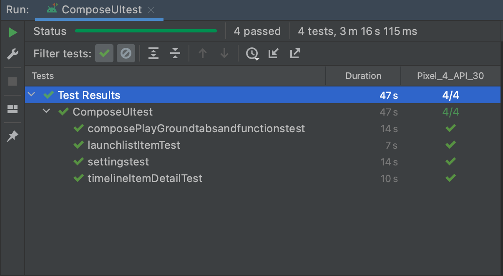

# UI tesztek készítése
---
A UI tesztek célja, hogy a unit tesztekkel ellentétben az üzleti logikától elvonatkoztatunk, és csak azt teszteljük amit a felhasználó lát, és a felhasználói interakciókat modellezve tesztelünk. A tesztelés eredményét az adja, hogy az interakció utáni látható állapotunk megegyezik-e az elvárt állapottal.

## Tesztek leírása, végrehajtása, eredménye
---
### **Tesztek leírása**

| Teszt neve | Teszt leírás|
|:-----------:|:-----:|
|settingstest| Settings menü tesztelése|
|launchlistItemTest| A kilövésre váró rakéták listájának tesztelése|
|timelineItemDetailTest| Egy kilövésre váró rakéta részletes nézetének tesztje|
|composePlayGroundtabsandfunctionstest| A composePlayGround nézet tesztelése|
---

### **Tesztek végrehajtása**

**settingstest**
1. Navigáció a settings menüpontba
2. Témaváltás dark, és light között (kódban nem sikerült a téma színének változását ellenőriznem, így erről futás közben tudtam csak magam meggyőződni)
3. "unconfirmed launches" gomb kattintása
4. "Show before" menü váltása, változás ellenőrzése
5. "Api endpoint" menü váltása, változás ellenőrzése
6. DropDown menü lenyitása, navigáció a libraries menüpontra
7. Lista első elemének létezésének ellenőrzése
8. Visszalépés Settings nézetre a visszagomb lenyomásával
9. Visszalépés a kiindulása nézetre ismételt vissza gomb navigációval

**launchlistItemTest**
1. Május("May") ellenőrzése a listában
2. Egy előzetesen kiválasztott májusi rakétakilövés létezése a megadott specifikációk alapján

**timelineItemDetailTest**
1. launchlistItemTest-ben is kiválasztott rakéta elemének megnyitása a listából
2. Adatainak ellenőrzése, hogy megegyeznek-e az előre megadott adatokkal.

**composePlayGroundtabsandfunctionstest**
1. Navigáció a composePlayGround nézetre
2. Anim felület ellenőrzése
3. Components felület ellenőrzése
4. "Text", "Outlined" feliratú elemek meglétének ellenőrzése
5. Balra görgelés a vízszintesen görgethető listán, hogy az első elemek láthatóvá/kattinthatóvá váljanak
6. Type felület ellenőrzése
7. Color felület ellenőrzése
8. Shape felület ellenőrzése
9. "Shape small/medium/large" elemek láthatóságának ellenőrzése
---

### **Tesztek eredménye**

A tesztek bár sikeresen lefutottak, nem teljesen egyértelmű eredmények is láthatóak voltak a fragmentek gyökérfelépítésének logjában. Bizonyos tab nézeteknél a composePlayGround esetén, például a "Color" esetében, nem értem el a színek neveit szöveg és azonosító alapján sem. Az adott nézethez kiírt log másik tab tartalmát írta ki, a "Components"-ét. A projekt readme-jében szereplő információból kiindulva, miszerint az alkalmazás megjelenítésének átírása folyamatban van compose-ra, arra következtettem, hogy itt még hibásan jelenít meg a fejlesztő információkat.  A tesztek eredményéről, egy a beszámoló nevével megegyező képernyőfotó megtalálható a docs mappában.

## Személyes tanulságok

Korábban nem végeztem Androidon tesztelést, illetve mélységbe nyúló fejlesztést sem, iOS platformon mozogtam, így kezdésnél nehézséget okozott a projekt áttekintése is számomra. Sok időbe telt mire megértettem, hogy hogyan épül fel a UI, hogyan működik a nav_graph.xml-es fragmentekre navigálás. Ennek megértése után egy újabb problémába ütköztem, mivel nehezen találtam meg, hogy adott elemek a fragmenteken belül hogyan jelennek meg, érhetőek el. Így volt amihez Modifier.testTag-et rendeltem, illetve volt aminek az elérését logCat-be való compose gyökér adataiból kerestem ki.

*Made by Kosztolánczi Dominik*
