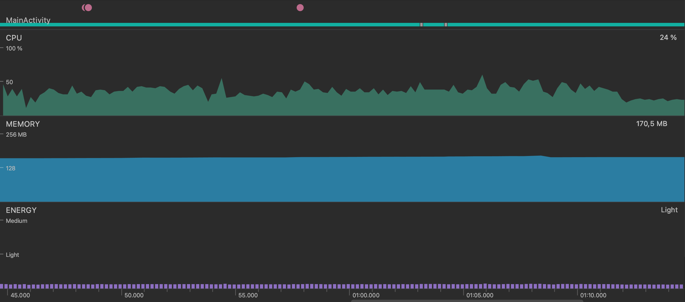
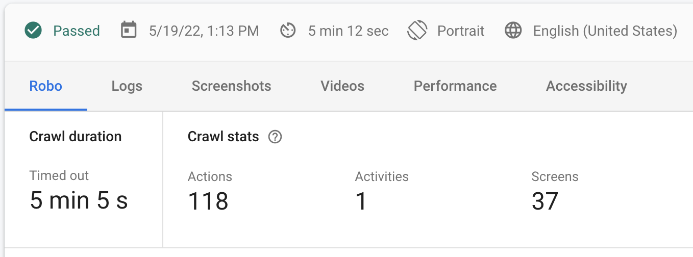
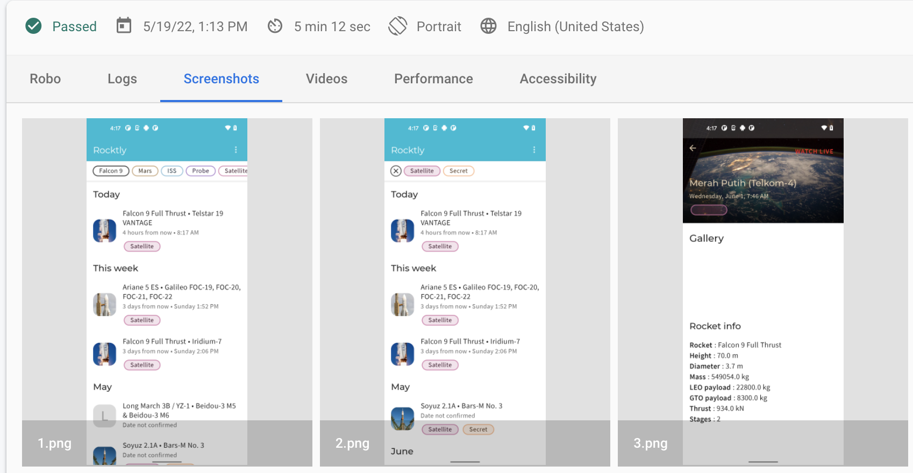
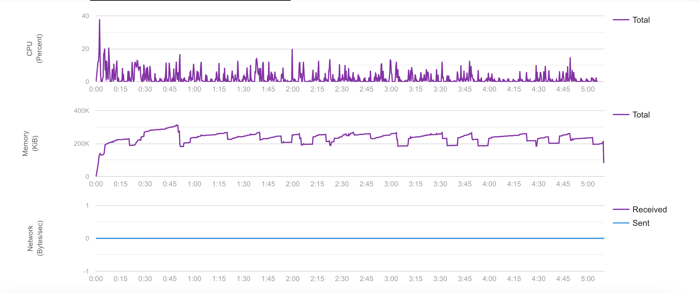
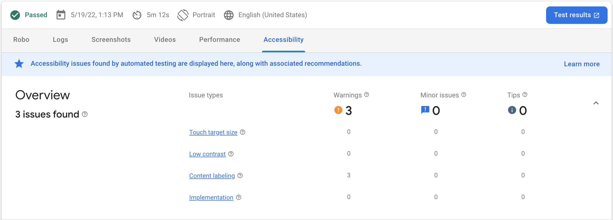

# Dokumentáció a nem-funkcionális jellemzők vizsgálatáról

A vizsgálat elvégzéséhez két eszközt használtam. Az első ilyen eszköz az Android Studio beépített Profiler tool-ja, a másik pedig a Firebase Test Lab.

## Profiler

A Profiler az alkalmazás futtatása közben adatokat gyűjt az inputok típusairól, illetve az aktuális erőforrás-felhasználásról,
 ilyenek például a CPU, Memória, és energiafelhasználás.

A Profiler visszajelzéséből elmondható, hogy az alkalmazás - bár nem a legerősebb hardveren fut az emulátorból adódóan,
 de így is a processzor 50% át kihasználja sok esetben.
  Külön kiemelném, hogy a felhasználói inputok közötti tétlen időben is gyakran megugrik a cpu használat.

## Firebase Test Lab

A Firebase Test Lab lehetővé teszi, hogy az appunkat .apk formátumban való feltöltés után automatikus teszteknek vessük alá.
A teszteket egy Robo test nevezetű tesztelő eszköz végzi. A Robo először feltérképezi az alkalmazásunk felépítését, majd automatikus felhasználói inputoknak veti alá.
Ez alatt pedig információkat gyűjt a futásról, lehetséges felhasználói felületi hibákat tár fel.
A .apk fájl feltöltése, és a futás befejezte után az alábbi információk tárulnak elénk.

A Robo pont alatt láthatjuk, hogy az alkalmazást bejárta, 5 percen keresztül folyamatosan.
A 118 action és 37 screen pedig azt jelenti, hogy adott screeneket többször is bejárt.

A Screenshot menü alatt a futás közbeni elért nézeteket rögzíti. Ebből néhány példáról képet is szúrtam be.
Többet között készített screenshotot a tagek használatáról, adott kilövés részletes megjelenítéséről, kilövéshez tartozó youtube link megnyitásáról.

A Performance pont alatt láthatjuk a ui teljesítményét. Az alkalmazás indítása és a valós elindulás között eltelt idő 0.7 másodperc volt.
Amit a többi ui tesztnél is tapasztaltunk, a Robo megerősített minket, az inputok lassan kerülnek feldolgozásra, ezt a 72% os "High input latency" jelzi.
A "Slow UI thread" 7% os értéke nem tökéletes, lassabb lesz adott folyamatok lefutása, ilyen lehet például a kilövések listájának betöltése, de ez még egészen elfogadható.

A Performance felület alatt továbbá az Android Studio Profiler-hez hasonló CPU, Memory, Network grafikont látunk.
A memória felhasználás mértéke megegyezik a Profilerben tapasztalttal, ez 180 és 300 MB között ingadozik.
A CPU kihasználtság alacsonyabb, ez abból következik, hogy egy erősebb eszközön futtatta a Robo az alkalmazást, de a kilengés itt is fennáll inputok közötti szünetben is esetenként.

Az Accessibility fül alatt egy általános értékelést kapunk az alkalmazás kezelési szempontjából, melyben a Test Lab figyelmeztetéseket, hibákat és javaslatokat is közöl velünk.
Jelen esetben 3 figyelmeztetést kaptunk a "Concent labeling"-re, ez azt jelenti, hogy nem minden felületegység van szövegesen alátámasztva, hogy micsoda és mit csinál.
 Ilyen például a timeline esetén megnyomott 3 pöttyből álló gomb, amely lenyitja a "Compose playground" és "Settings" menüket.

## Személyes tapasztalatok

Az Android Studio beépített Profiler eszköze mint gyakran az integrált megoldásoktól várható, nem szolgál túl bő adathalmazzal.
Ezzel szemben a Firebase Test Lab nagyobb mélységekbe menő teljesítmény adatokat ad vissza, emellett stressz-teszterként is funkcionál, mivel sok, gyors egymásutáni user inputot bocsájt az alkalmazásnak feldolgozásra.
